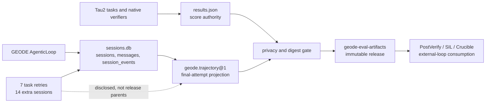

# GPT-5.4 subscription Tau2 base full cycle — 2026-08-03 KST

## Outcome

The three Tau2 base domains completed at GEODE revision
`22789ee28e87ba03580beec3db6e919f5cef5178` with no missing or duplicate task
IDs. The aggregate is **200/278 = 0.7194**.

| Domain | Passes | Reward | Termination | Mean / p50 / p95 / max |
|---|---:|---:|---|---:|
| Airline | 42/50 | **0.8400** | 50 user stop | 126.79 / 92.13 / 248.63 / 776.06s |
| Retail | 79/114 | **0.6930** | 96 user stop, 18 too-many-errors | 93.62 / 85.39 / 182.13 / 342.84s |
| Telecom | 79/114 | **0.6930** | 98 user stop, 14 max-steps, 2 too-many-errors | 351.65 / 261.84 / 957.65 / 995.78s |

This is a full GEODE route diagnostic, not a Tau2 leaderboard result. Both
`geode_agent` and `geode_user` used GPT-5.4 through the OpenAI subscription
route at `high` effort. A native Tau2 `user_simulator` was not used, so the
aggregate must not replace or be averaged into the native-user headline.
`promotion_authority=none`.

## Measured contract

| Field | Value |
|---|---|
| Harness | `sierra-research/tau2-bench@1901a301961cbbe3fd11f3e84a2a376530c759e3`, `tau2==1.0.0` |
| Split / trials | `base`, one trial |
| Concurrency | 2 |
| Max steps / errors | 200 / 1 |
| Agent / user budget | 600s / 180s |
| Per-simulation timeout | 3600s |
| Seed | 300 |
| Trajectory stage | `benchmark` |
| Transport retry limit | Airline 0; Retail and Telecom 1 |

The measured wall-clock windows were 09:18–10:14 Airline,
10:36–12:08 Retail, and 12:11–18:06 Telecom, all KST.

## Verifier detail

| Domain | Read | Write | Generic | Environment | DB |
|---|---:|---:|---:|---:|---:|
| Airline | 85/91 | 33/49 | 1/2 | — | 43/50 |
| Retail | 265/307 | 114/141 | 4/14 | — | 80/96 |
| Telecom | — | 308/377 | 20/20 | 155/181 | 22/98 |

Telecom exposes the strongest behavioral split:

| Slice | Passes |
|---|---:|
| Service issue | 28/29 (96.6%) |
| Mobile-data issue | 30/36 (83.3%) |
| MMS issue | 21/49 (42.9%) |
| Easy persona | 29/38 (76.3%) |
| Hard persona | 21/36 (58.3%) |
| No persona | 29/40 (72.5%) |

The MMS tail is not explained by complexity alone. Some 8–9 action cases
completed successfully, while other runs emitted a normal `USER_STOP` after
only 2/11 or 6/10 required actions. Fourteen cases reached `MAX_STEPS`.
Seven runs emitted the GEODE no-progress supervisor stop; six failed and one
passed. Other retained failures include an invalid line identifier and a
customer/line relationship mismatch.

This is direct evidence that protocol-level `Stop` is not task success.
`PostVerify` can use missing action, environment, and DB evidence to return
`accept`, `revise`, or `escalate` before an outer loop promotes the result.

## Storage and trajectory quality

| Domain | Parent sessions | SQLite / normalized events | Messages | Tool pairs | Payload issues |
|---|---:|---:|---:|---:|---:|
| Airline | 100 | 4,924 / 4,924 | 1,474 | 369/369 | 3,853 |
| Retail | 228 | 10,718 / 10,718 | 3,299 | 827/827 | 8,375 |
| Telecom | 228 | 36,343 / 36,343 | 4,375 | 2,768/2,768 | 29,292 |
| **Total** | **556** | **51,985 / 51,985** | **9,148** | **3,964/3,964** | **41,520** |

Every exported event ID is unique, ordinals are contiguous, and there are no
orphan tool calls or results. All 556 selected sessions ended `completed`.
The stable `geode.trajectory@1` release is `scope_complete=true` for the
final 278 task attempts and `replay_complete=false`: bounded/redacted bodies,
provider-private state, hidden reasoning, credentials, and private prompts are
not public replay material.

The benchmark constructs an isolated `AgenticLoop` without a `HookSystem`,
so the selected sessions contain zero `hook_events`. This full cycle verifies
runtime lifecycle and behavior trajectories, not public-hook dispatch. The
separate hook/middleware E2E release remains the authority for the 13 public
hooks and four trusted middleware boundaries.

There is no project-local JSONL for these sessions. SQLite
`session_events` is the execution event authority; Tau2 `results.json` is
the score authority; the immutable trajectory is the portable projection.

## Retry lineage

Telecom used seven task-level retries for provider transport failures. Those
retries created exactly 14 additional SQLite sessions—one agent and one user
session per attempt. The final trajectory parent list selects 228 final
sessions (114 tasks × two participants); it does not claim replay completeness
for discarded transport attempts. One additional adapter-internal retry
recovered an incomplete streamed read without restarting its Tau2 task.

Tau2's console phrase “succeeded on retry” means the retried simulation
completed. It does not imply verifier success; at least one such task completed
with reward 0 and `MAX_STEPS`. This report always uses `results.json`
reward and termination fields as authority.

## Privacy and digests

Restricted raw receipt SHA-256 values:

- Airline: `f15dc8b6798009161e0b14fbd2a86ededf82f08980a1447475aab5ecd43c7f51`
- Retail: `4cbd04b3e847aabb0f96c5cf5b50318cb36d6e35c65c230cc7f044bbdbe0d97f`
- Telecom: `6ac4f16c4954705dc87b17cae520f9ac882f7fafd4085a54c700716bfeaea9df`

Public receipt SHA-256 values after synthetic phone/email and absolute-home
masking:

- Airline: `1d7d37971554eca4d4202845587f60a1c1ec62b663ee80fda8109385eae8f1bf`
- Retail: `037376bf56a953167b7864f5336a4736f0cc76594803924580f247c6f2dd5e55`
- Telecom: `4fc9c8448f2484f9b9a15040057598c3533eb1e8a1846e059d3615e16d88d75e`

Upstream synthetic names, identifiers, and verifier state remain because they
are public benchmark fixtures. The release gate found zero absolute-home,
email, GitHub-token, OpenAI-key, bearer-token, AWS-key, URL-secret, or known
secret matches.

## External-loop compatibility

- SIL retains executable evaluator outputs and attribution/mutation ledgers as
  authority. The trajectory supplies stable correlation and behavior evidence.
- Crucible can ingest the immutable trajectory and native receipt digest, but
  this diagnostic has no frozen candidate arm and therefore no promotion
  authority.
- A downstream workflow can join score and behavior by raw SHA without
  importing GEODE's SQLite/WAL or mutable local session files.

## Public anchors

- Native copies: `tau2/simulations/geode-gpt54-high-22789ee2-geode-user-*/`
- Stable trajectory release:
  `trajectories/tau2-geode-gpt54-22789ee2-geode-user-airline-retail-telecom-base-full-20260803T091257Z-13162f7bcff9/`
- Manifest SHA-256:
  `13162f7bcff9ade1194f41af06549f0b0f239847f59630d5223386e2ca6362b3`
- Machine report:
  `reports/e2e-validation/2026-08-03-gpt54-tau2-full-cycle.json`
- Privacy review:
  `reports/privacy-reviews/2026-08-03-geode-gpt54-tau2-full.json`

Remote readback remains required until the artifact PR is merged.
