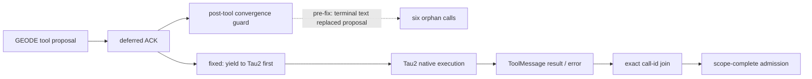

# GPT-5.4 runtime-faithful Tau2 full-cycle diagnostic

Date: 2026-08-04

## Ruling

This is an infrastructure-invalid diagnostic, not a score release. GEODE
revision `f08e7d6f5c785f76881ea2f9dfc2983ced8556d8` scheduled all 278 Tau2 base
tasks with `geode_agent + geode_user`, GPT-5.4 subscription, and effort `high`.
Subscription quota exhaustion left 99 rows without semantic results. They are
missing work, not zero rewards, so no aggregate score is reported and the
admitted 2026-08-03 result (200/278) is not replaced.

| Domain | Scheduled | Reward-bearing | Pass | Infrastructure | Trajectory |
|---|---:|---:|---:|---:|---|
| Airline | 50 | 48 | 42 | 2 | admitted by hardened verifier |
| Retail | 114 | 98 | 76 | 16 | admitted by hardened verifier |
| Telecom | 114 | 33 | 30 | 81 | rejected: six orphan calls |
| **Total** | **278** | **179** | **148** | **99** | **no aggregate authority** |

## Runtime contract evidence

Every domain profile records all 13 public hooks and all four middleware join
points. Conditional hooks that did not occur remain `not_exercised`. The
normalized projections contain 22,971 events across 358 selected participant
sessions. Airline has 415/415 exact tool pairs; Retail has 674/674. Telecom has
614 calls and 608 results, leaving six calls without results and therefore
`scope_complete=false`.

The live evidence isolated the ordering defect before quota exhaustion. In the
pre-fix loop, a deferred projection ACK could reach repeated-success detection
before the external half-duplex orchestrator received the proposal. Remediation
PR [GEODE #2869](https://github.com/mangowhoiscloud/geode/pull/2869) moves the
external yield before local convergence guards and makes Crucible recompute the
hash-bound normalized trajectory integrity.

## Published artifacts

`crucible/runs/trajectory-snapshots/runtime-faithful-20260804/` contains, per
domain:

- the digest-only `geode.trajectory@1` projection;
- the runtime profile with revision, route, prompt/tool digests, hook and
  middleware observations;
- the attempt manifest with retry and final-selection lineage;
- a path-sanitized snapshot-v4 commit marker.

`MANIFEST.sha256` covers all 12 JSON files. Native receipts, SQLite/WAL files,
raw dialogue/tool bodies, hidden reasoning, credentials, private prompts, and
mutable GEODE homes are excluded. The raw native receipt SHA-256 remains bound
through each profile and normalized trajectory.

The embedded trajectory privacy state remains the immutable producer value
`local`; the separate publication review upgrades only the public-copy
attestation. A stable `trajectories/` release is intentionally absent because
that contract requires `scope_complete=true`.

## Next gate

A clean 278-task rerun is required after subscription capacity returns. It must
produce zero infrastructure rows, three scope-complete normalized trajectories,
and snapshot-v4 admission under the hardened verifier before any replacement
score can be published.
